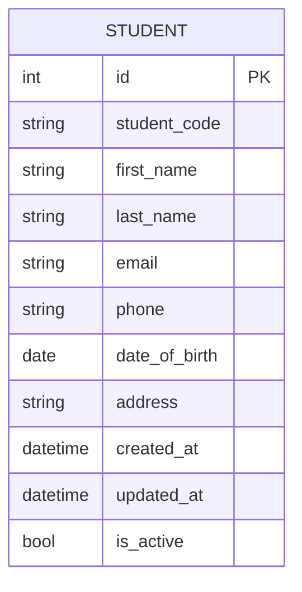
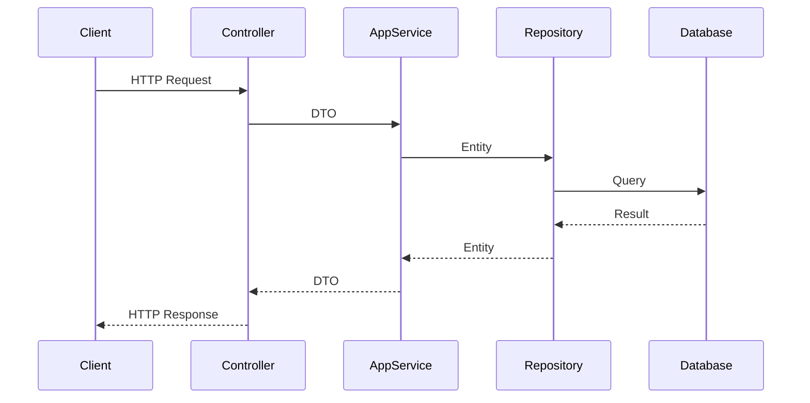

# Tài liệu thiết kế kỹ thuật: API CRUD Student

## 1. Tổng quan

API CRUD Student cung cấp các chức năng cơ bản để quản lý thông tin sinh viên trong hệ thống, bao gồm tạo mới, đọc, cập nhật và xóa thông tin sinh viên.

## 2. Yêu cầu

### 2.1 Yêu cầu chức năng

- Người dùng có thể tạo mới thông tin sinh viên với các thông tin cơ bản
- Người dùng có thể xem danh sách tất cả sinh viên
- Người dùng có thể xem chi tiết thông tin của một sinh viên theo ID
- Người dùng có thể cập nhật thông tin sinh viên
- Người dùng có thể xóa thông tin sinh viên

### 2.2 Yêu cầu phi chức năng

- API phải được bảo mật bằng JWT authentication
- Hệ thống phải xử lý được 100 request/giây
- Thời gian phản hồi API không quá 200ms
- Dữ liệu phải được validate trước khi lưu vào database

## 3. Thiết kế kỹ thuật

### 3.1. Thay đổi mô hình dữ liệu



### 3.2. Thay đổi API

#### 3.2.1. Tạo mới sinh viên

```http
POST /api/v1/students
Content-Type: application/json
Authorization: Bearer {token}

{
    "studentCode": "SV001",
    "firstName": "Nguyễn",
    "lastName": "Văn A",
    "email": "nguyenvana@example.com",
    "phone": "0123456789",
    "dateOfBirth": "2000-01-01",
    "address": "123 Đường ABC, Quận XYZ, TP.HCM"
}
```

Response (200 OK):

```json
{
  "id": 1,
  "studentCode": "SV001",
  "firstName": "Nguyễn",
  "lastName": "Văn A",
  "email": "nguyenvana@example.com",
  "phone": "0123456789",
  "dateOfBirth": "2000-01-01",
  "address": "123 Đường ABC, Quận XYZ, TP.HCM",
  "createdAt": "2024-03-20T10:00:00Z",
  "updatedAt": "2024-03-20T10:00:00Z",
  "isActive": true
}
```

#### 3.2.2. Lấy danh sách sinh viên

```http
GET /api/v1/students
Authorization: Bearer {token}
```

Response (200 OK):

```json
{
  "items": [
    {
      "id": 1,
      "studentCode": "SV001",
      "firstName": "Nguyễn",
      "lastName": "Văn A",
      "email": "nguyenvana@example.com",
      "phone": "0123456789",
      "dateOfBirth": "2000-01-01",
      "address": "123 Đường ABC, Quận XYZ, TP.HCM",
      "createdAt": "2024-03-20T10:00:00Z",
      "updatedAt": "2024-03-20T10:00:00Z",
      "isActive": true
    }
  ],
  "totalCount": 1,
  "pageSize": 10,
  "currentPage": 1
}
```

#### 3.2.3. Lấy thông tin chi tiết sinh viên

```http
GET /api/v1/students/{id}
Authorization: Bearer {token}
```

Response (200 OK):

```json
{
  "id": 1,
  "studentCode": "SV001",
  "firstName": "Nguyễn",
  "lastName": "Văn A",
  "email": "nguyenvana@example.com",
  "phone": "0123456789",
  "dateOfBirth": "2000-01-01",
  "address": "123 Đường ABC, Quận XYZ, TP.HCM",
  "createdAt": "2024-03-20T10:00:00Z",
  "updatedAt": "2024-03-20T10:00:00Z",
  "isActive": true
}
```

#### 3.2.4. Cập nhật thông tin sinh viên

```http
PUT /api/v1/students/{id}
Content-Type: application/json
Authorization: Bearer {token}

{
    "firstName": "Nguyễn",
    "lastName": "Văn B",
    "email": "nguyenvanb@example.com",
    "phone": "0987654321",
    "dateOfBirth": "2000-01-01",
    "address": "456 Đường XYZ, Quận ABC, TP.HCM"
}
```

Response (200 OK):

```json
{
  "id": 1,
  "studentCode": "SV001",
  "firstName": "Nguyễn",
  "lastName": "Văn B",
  "email": "nguyenvanb@example.com",
  "phone": "0987654321",
  "dateOfBirth": "2000-01-01",
  "address": "456 Đường XYZ, Quận ABC, TP.HCM",
  "createdAt": "2024-03-20T10:00:00Z",
  "updatedAt": "2024-03-20T11:00:00Z",
  "isActive": true
}
```

#### 3.2.5. Xóa sinh viên

```http
DELETE /api/v1/students/{id}
Authorization: Bearer {token}
```

Response (200 OK):

```json
{
  "success": true,
  "message": "Student deleted successfully"
}
```

### 3.3. Luồng xử lý



### 3.4. Dependencies

- Microsoft.EntityFrameworkCore
- AutoMapper
- FluentValidation
- JWT Authentication

### 3.5. Cân nhắc bảo mật

- Tất cả API endpoints phải được bảo vệ bằng JWT authentication
- Validate dữ liệu đầu vào để ngăn chặn SQL injection
- Mã hóa dữ liệu nhạy cảm
- Kiểm tra quyền truy cập cho mỗi request

### 3.6. Cân nhắc hiệu suất

- Sử dụng caching cho các request đọc dữ liệu
- Tối ưu hóa các câu query database
- Sử dụng pagination cho danh sách sinh viên
- Index các trường thường xuyên tìm kiếm

## 4. Kế hoạch kiểm thử

### 4.1. Unit Tests

- Kiểm tra validation rules
- Kiểm tra business logic trong AppService
- Kiểm tra mapping giữa DTO và Entity

### 4.2. Integration Tests

- Kiểm tra tương tác giữa Controller và AppService
- Kiểm tra tương tác giữa AppService và Repository
- Kiểm tra tương tác với database

### 4.3. API Tests

- Kiểm tra các API endpoints
- Kiểm tra response format
- Kiểm tra error handling
- Kiểm tra authentication và authorization

## 5. Câu hỏi mở

- Có nên thêm tính năng tìm kiếm nâng cao không?
- Có nên thêm tính năng import/export dữ liệu sinh viên không?
- Có nên thêm tính năng quản lý ảnh đại diện sinh viên không?

## 6. Các giải pháp thay thế đã xem xét

- Sử dụng GraphQL thay vì REST API: Bị từ chối do độ phức tạp và yêu cầu hiện tại không cần thiết
- Sử dụng MongoDB thay vì SQL Server: Bị từ chối do yêu cầu tính nhất quán dữ liệu cao
- Sử dụng gRPC thay vì REST API: Bị từ chối do yêu cầu hiện tại không cần hiệu suất cao đến mức đó
