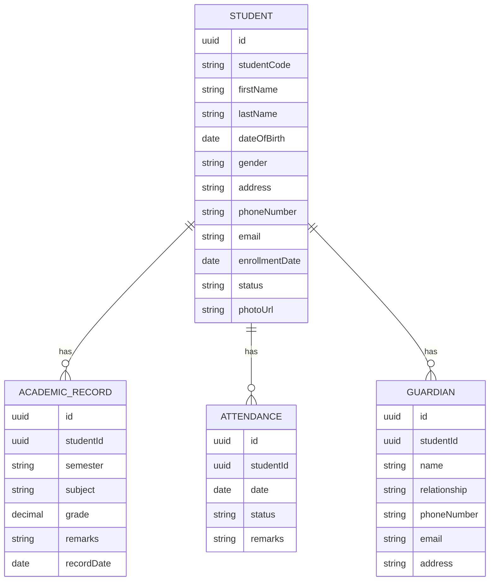
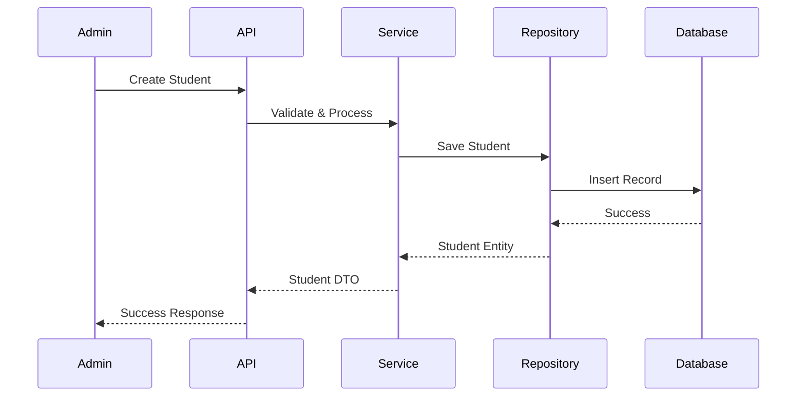

# Technical Design Document: Student Management System

## 1. Overview

The Student Management System is designed to provide comprehensive functionality for managing student information, including personal details, academic records, attendance, and performance tracking. This system will serve as a centralized platform for educational institutions to maintain and manage student data efficiently.

## 2. Requirements

### 2.1 Functional Requirements

* As an administrator, I want to create, read, update, and delete student records so that I can manage student information effectively.
* As a teacher, I want to view student academic records so that I can track their progress.
* As a teacher, I want to record and view student attendance so that I can monitor their class participation.
* As an administrator, I want to generate reports on student performance so that I can analyze academic trends.
* As a student, I want to view my own academic records and attendance so that I can track my progress.
* As a parent, I want to view my child's academic records and attendance so that I can monitor their education.

### 2.2 Non-Functional Requirements

* The system should handle up to 10,000 student records efficiently.
* All sensitive student data must be encrypted at rest and in transit.
* The system should maintain an audit trail of all changes to student records.
* The system should be accessible 24/7 with 99.9% uptime.
* The system should support role-based access control for different user types.
* The system should be responsive, with page load times under 2 seconds.

## 3. Technical Design

### 3.1. Data Model Changes



### 3.2. API Changes

#### Student Management Endpoints

1. Create Student
```http
POST /api/students
Content-Type: application/json

{
    "studentCode": "STU2024001",
    "firstName": "John",
    "lastName": "Doe",
    "dateOfBirth": "2005-01-01",
    "gender": "Male",
    "address": "123 Main St",
    "phoneNumber": "0123456789",
    "email": "john.doe@example.com"
}
```

2. Get Student Details
```http
GET /api/students/{id}
```

3. Update Student
```http
PUT /api/students/{id}
Content-Type: application/json

{
    "firstName": "John",
    "lastName": "Doe",
    "phoneNumber": "0123456789",
    "email": "john.doe@example.com"
}
```

4. Delete Student
```http
DELETE /api/students/{id}
```

#### Academic Record Endpoints

1. Add Academic Record
```http
POST /api/students/{id}/academic-records
Content-Type: application/json

{
    "semester": "2024-1",
    "subject": "Mathematics",
    "grade": 8.5,
    "remarks": "Excellent performance"
}
```

#### Attendance Endpoints

1. Record Attendance
```http
POST /api/students/{id}/attendance
Content-Type: application/json

{
    "date": "2024-03-15",
    "status": "Present",
    "remarks": "On time"
}
```

### 3.3. Logic Flow



### 3.4. Dependencies

* Entity Framework Core for data access
* AutoMapper for object mapping
* FluentValidation for input validation
* MediatR for CQRS pattern implementation
* JWT for authentication
* Serilog for logging

### 3.5. Security Considerations

* Implement JWT-based authentication
* Use role-based authorization
* Encrypt sensitive student data
* Implement audit logging for all data modifications
* Validate all user inputs
* Implement rate limiting for API endpoints
* Use HTTPS for all communications

### 3.6. Performance Considerations

* Implement caching for frequently accessed data
* Use database indexing for common queries
* Implement pagination for large data sets
* Use async/await for I/O operations
* Implement database connection pooling
* Use compression for API responses

## 4. Testing Plan

### Unit Tests
* Test student creation, update, and deletion
* Test academic record management
* Test attendance tracking
* Test validation rules
* Test business logic

### Integration Tests
* Test API endpoints
* Test database operations
* Test authentication and authorization
* Test data validation

### Performance Tests
* Test system under load
* Test database query performance
* Test API response times

## 5. Open Questions

* Should we implement a bulk import feature for student data?
* How should we handle student photo storage?
* What is the retention policy for student records?
* Should we implement a notification system for attendance alerts?

## 6. Alternatives Considered

1. **Monolithic vs Microservices Architecture**
   * Chose monolithic architecture due to simpler deployment and maintenance
   * Microservices would add unnecessary complexity for current requirements

2. **SQL vs NoSQL Database**
   * Chose SQL database for better data consistency and relationships
   * NoSQL would be more complex to implement for relational data

3. **Custom Authentication vs Identity Server**
   * Chose custom JWT implementation for simplicity
   * Identity Server would be overkill for current requirements 